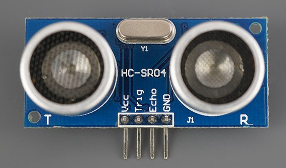

# stm32f1libs
___
# HC-SR04 Ultrasonic Sensor API

    
    
    

---

This API was developed as part of the Embedded Systems Programming course at UFMG - Prof. Ricardo de Oliveira Duarte – Department of Electronic Engineering.

This API contains functions to provide use of some hardware resources from HC-SR04 Ultrasonic Sensor available at: http://wiki.sunfounder.cc/index.php?title=Ultrasonic_Module

---
# Sensor specifications
- Sensor to mesure distance in a range 2 - 400 cm
- Ease of use
- Resolution: 0.3 cm
- Trigger Input Pulse width: 10 us
- Dimension: 45mm x 20mm x 15mm
- Power Supply: 3~5V DC

---
# Hardware requirements:
 - HC-SR04 ultrasonic sensor datasheet: https://pdf1.alldatasheet.com/datasheet-pdf/view/1132203/ETC2/HC-SR04.html

## Default pinout:

| PIN | STM32F103RB LABELS | Description |
|---|---|---|
| VCC | 3~5V | Powers the sensor |
| Trig | GPIO_Output | Trigger Input Pin: if set to HIGH for 10 us HC-SR04 will send out eight cycle sonic burst at 40 kHz |
| Echo | GPIO_Input | Echo Output Pin: goes to HIGH automatically once the burst is sent and will remain HIGH until the burst hits the sensor again |
| GND | GND | Common GND |

This API was implemented and tested in STM32 Nucleo-F103RB MCU. However, it is possible to use it with any other board that has 1 GPIO-Input and 1 GPIO-Output available, as listed in the table above. In this case, it is necessary to change the included files from the HAL library to the proper one,according to your MCU.
 
 - STM NUCLEO-F103RB MAnufacturer website: https://www.st.com/en/microcontrollers-microprocessors/stm32f103.html

---
## Software requirements:
- STM32CubeIDE 1.6.1: Available at https://www.st.com/en/development-tools/stm32cubeide.html

---
## API main files:
- Ultrassonico.c
- Ultrassonico.h

---
## How to use it:

To use it, it is necessary to include "Ultrassonico.h" and "Ultrassonico.c" in your main file and define the Input/Output pins according to the labels provided in the table.

---
### Results
An visual result of the use API can be seen in this [video](https://youtu.be/U_fcDDDJzoM)
